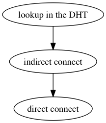
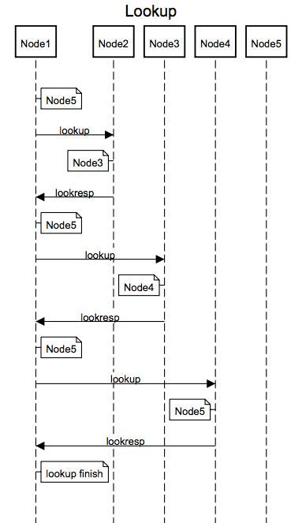
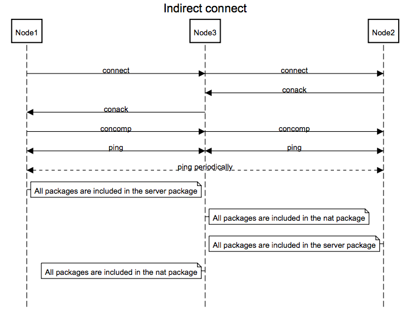
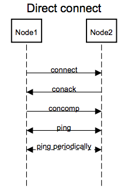

# MATE协议

------

P2P网络中经常需要快速准确地发现目标节点，由于如今网络的复杂化使得这一目标并不容易达成，尤其是存在大量通过NAT实现的专有网络的情况下。此协议旨在解决现有网络条件下发现P2P节点并保证其可用性的问题，它借鉴了部分[DHT协议](http://www.bittorrent.org/beps/bep_0005.html)的实现原理，但它并不同于DHT协议。

## 概述
网络中每个节点都使用一串[UUID](http://zh.wikipedia.org/wiki/通用唯一识别码)作为ID，此ID作为节点在整个网络中的唯一标识符，用于后续节点的发现与连接。任一节点已知的所有节点（包括自身）信息都存放于由[Kademlia](http://zh.wikipedia.org/wiki/Kademlia)算法实现的路由表中,它使用节点ID作为索引，ID异或结果作为节点间距离，因而可在路由表中找出距离某一节点最近的一些节点（非地理位置距离）。
协议基于UDP实现，其总体流程如下图所示。

首先在DHT中寻找目标节点，找到后判断其是否位于本地的路由表中：如果是则直接根据本地路由表返回的节点信息进行连接；否则先连接存有此目标节点的路由表所在的节点，最后再连接目标节点。

### 节点发现
假设自身节点为Node1，需要寻找节点Node5。首先在Node1的路由表中查询Node5，获得异或距离最近的一些节点信息列表。如果列表中包含Node5则表明已经找到所需节点，发现流程结束；否则继续对列表中每个节点的路由表都发起查询请求，依此递归操作，直到超时。时序图如下。

### 节点连接
假设自身节点为Node1，需要连接的节点为Node2，包含Node2的路由表所在节点为Node3，起始连接状态为connecting（连接中）。Node1首先使用Node3做代理连接Node2，如果连接成功则将连接状态改为tranship（转发），否则连接失败。时序图如下。

然后Node1尝试直接连接Node2，如果连接成功则将连接状态置为connected（已连接）。时序图如下。

具体连接过程与TCP连接类似，包括以下几个步骤：
> 1. 连接发起端向被连接端发送connect；
> 2. 被连接端回应conack；
> 3. 连接两端周期性向对方发送ping；
> 4. 连接两端在一定时间内（大于ping周期）未收到回应则连接失败。
